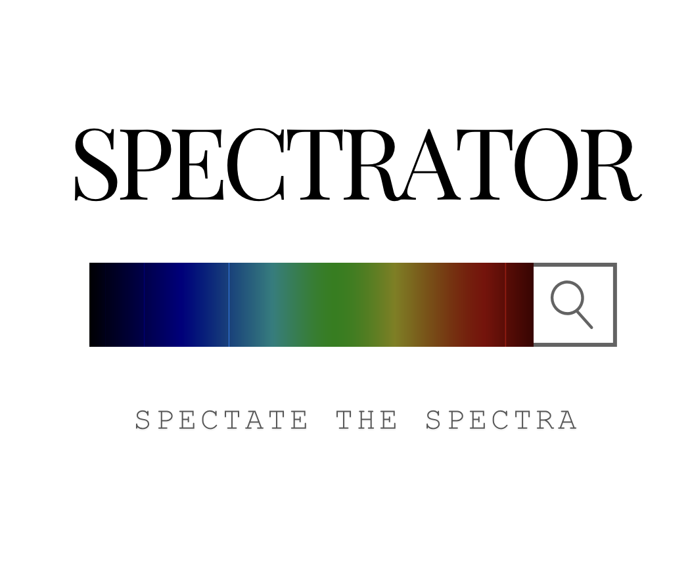

# Spectrator
**Spectate the Spectra**
Platform and tool to query spectra across multiple catalogues from one place.

Spectrator is a query tool to eliminate the hassle of going through individual catalogues to look for an object. It is tool/platform to search and display spectra across multiple surveys with different ranges. By querying several catalogues simultaneously, Spectrator will be unified platform to retrieve, cross-match, and explore spectra for any given astronomical object. This shall be a good starting place to be before going too deep in a catalogue.

## Features
Yet to be decided/under development.
